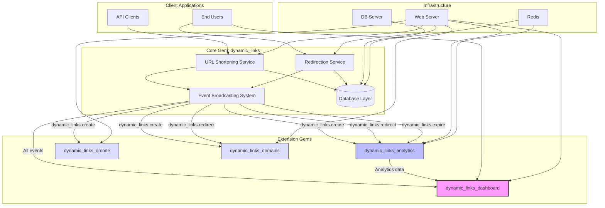

## System Design for Rails Dynamic Links

**Purpose**: The app is intended for private service and is not meant to be directly accessible by end users. The deployment target is Kubernetes.

### Core Features

1. **Shortening URLs**: Store original link, shortened link.
2. **Redirecting Short URLs**: Handle redirection from short to original URLs.
3. **Event Broadcasting**: Emit Rails Instrumentation events that plugins can subscribe to.

### Optional Plugin Features (Separate Gems)

1. **Analytics** (`dynamic_links_analytics`): Track link usage, referrers, etc.
2. **QR Code Generation** (`dynamic_links_qrcode`): Generate QR codes for shortened URLs.
3. **Custom Domains** (`dynamic_links_domains`): Support for multiple custom domains.
4. **Advanced Statistics** (`dynamic_links_statistics`): Detailed reporting and dashboards.
5. **Dashboard** (`dynamic_links_dashboard`): Administrative interface for managing and visualizing data.

### Performance Needs

- Shortening URL feature: Up to 60 requests per minute (RPM) during peak hours.
- Redirection feature: Up to 600 RPM during peak hours.

### Scalability

- **Web Server**: Horizontal auto-scaling based on CPU load and RPM.
- **DB Server**: Horizontal auto-scaling based on CPU load.
- **Redis Server**: Horizontal scaling.

### Security Concerns

- Input validation to prevent injections and other attacks.
- Rate limiting per client to prevent abuse, using Rack::Attack gem for API Key limits.
- Malicious content is out of scope as this is for private use.

### Architecture

- Monolithic architecture using Ruby on Rails v7.
- **Plugin-Based Design**: Core functionality is maintained in the `dynamic_links` gem, while additional features are implemented as separate complementary gems:
  - The core gem provides extension points via Rails Instrumentation events
  - Additional functionality should be implemented as separate gems (e.g., `dynamic_links_analytics`)
  - This approach allows for modularity, flexibility, and cleaner maintenance

### Architecture Diagram



The highlighted `dynamic_links_dashboard` extension would provide an administrative interface to manage and visualize the data collected by the core system and other extensions.

### Database Design

- **High Priority**: Support for any DB supported by ActiveRecord (MySQL, MariaDB, PostgreSQL), with PostgreSQL as the first target.
- **Normal Priority**: MongoDB with initial configuration only; no plans for data migration to a new DB.
- **Low Priority**: Cassandra DB.
- Implement Hash Based Partitioning based on the `client_id` column.
- Cache DB: Redis

### Shortening Strategy

Supports two methods for URL shortening:
1. **By Algorithm**: Default method with options like MD5, SHA-256, CRC32, nanoid, and a counter-based approach using a Redis counter or MongoDB primary key.
2. **By KGS (Key Generation Service)**: Requires ActiveJob to seed available short links.
3. **Manual Entry**: Users can write custom shortened URL characters (max 16 characters).

_Notes_:
- Both methods support time expiration (default: 100 years). An ActiveJob worker deletes expired data nightly. The redirection controller sends a job to delete expired URLs before showing a 404 page.
- System can switch to KGS for performance optimization.

### Analytics Tracking

- Uses "HTTP 302 Redirect" to ensure all redirection requests reach the backend for analytics. This is crucial for functional requirements.
- **Implementation**: 
  - Core functionality (`dynamic_links`) will trigger Rails Instrumentation events on redirect
  - Analytics tracking should be implemented in a separate gem (e.g., `dynamic_links_analytics`)
  - The analytics gem subscribes to events from the core gem and processes them using Ahoy gem
  - This separation maintains a clean core codebase while allowing for optional analytics features

### API Design

- Provides RESTful APIs for creating, retrieving, and managing short URLs.

### Analytics and Monitoring

- **Core Gem**:
  - Logging: Utilizes Rails' logging feature for basic operations
  - Event Broadcasting: Emits instrumentation events for all significant actions

- **Analytics Plugin** (`dynamic_links_analytics`):
  - Implemented using the Ahoy gem
  - Subscribes to core events and records analytics data
  - Provides visualization and reporting capabilities

### Compliance and Privacy

- Adheres to policies outlined by the Ahoy gem.

### Deployment Strategy

- **CI/CD**: Implemented using GitHub Actions.

### Extension Points and Plugin Development

- **Core Events**: The `dynamic_links` gem emits the following instrumentation events:
  - `dynamic_links.redirect`: Triggered when a short link is accessed and redirected
  - `dynamic_links.create`: Triggered when a new short link is created
  - `dynamic_links.expire`: Triggered when a link expires

- **Plugin Development**: To create complementary gems:
  1. Subscribe to core events using Rails Instrumentation
  2. Implement additional functionality without modifying the core gem
  3. Follow naming convention: `dynamic_links_*` (e.g., `dynamic_links_analytics`, `dynamic_links_qrcode`)

- **Example: Analytics Implementation**
  ```ruby
  # In dynamic_links_analytics gem
  ActiveSupport::Notifications.subscribe('dynamic_links.redirect') do |name, start, finish, id, payload|
    # Record the event using Ahoy
    Ahoy::Event.track(
      "Link Clicked", 
      url: payload[:original_url],
      short_code: payload[:short_code],
      user_agent: payload[:user_agent]
    )
  end
  ```

### Future Extensions

#### Dynamic Links Dashboard (`dynamic_links_dashboard`)

The dashboard extension will provide a web-based administrative interface with the following capabilities:

- **Data Management**:
  - View and search all shortened URLs
  - Create, edit, and delete links manually
  - Bulk operations (import/export, enable/disable)
  - Filter links by status, creation date, expiration, etc.

- **Analytics Visualization**:
  - Traffic overview with charts and graphs
  - Click-through rates and geographic distribution
  - Referrer analysis
  - User agent and device statistics

- **System Management**:
  - Configuration of the core system
  - Extension management
  - API key administration

- **Implementation Details**:
  - Uses its own UI components (likely Hotwire/Stimulus or React)
  - Interfaces with core system via instrumentation events
  - Consumes data from other extensions like `dynamic_links_analytics`
  - Can be mounted as a Rails engine in the main application

The dashboard will be implemented as a separate gem to maintain the plugin-based architecture, ensuring the core system remains lightweight and focused on its primary functionality.
